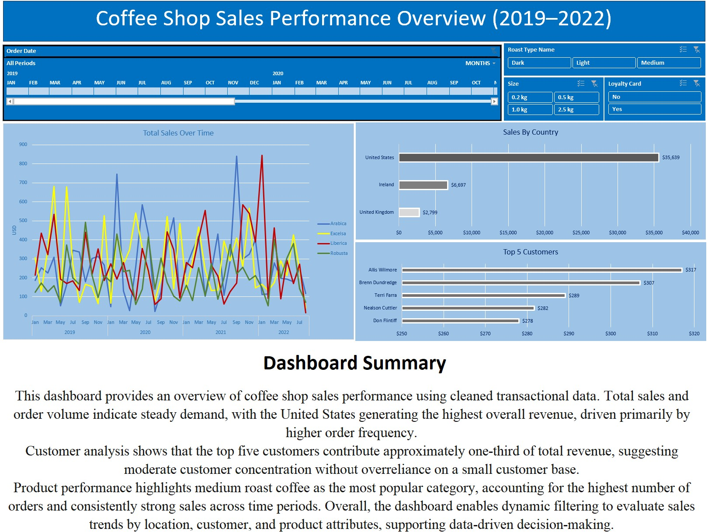

# Coffee Shop Sales Dashboard (Excel)

## Overview

This project analyzes coffee shop sales performance using Microsoft Excel.
Raw transactional data was cleaned, transformed, and used to build an interactive KPI-driven dashboard that enables exploration of sales trends by customer, location, and product category.

---

## Dashboard Overview

Key insights from the analysis include:

* United States generates the highest total sales.
* Medium roast is the most popular product category.
* Top 5 customers contribute a significant portion of overall revenue.
* Interactive slicers allow dynamic filtering across multiple dimensions.

---

## KPIs Tracked

* Total Sales
* Orders Count
* Average Order Value

---

## Tools Used

* Microsoft Excel
* PivotTables
* Data Cleaning
* Dashboard Design
* Data Visualization

---

## Project Structure

dashboard/ → Final Excel dashboard
data/ → Raw dataset used for cleaning
visuals/ → Dashboard preview image

---

## Skills Demonstrated

* Data cleaning and transformation
* Business-focused dashboard design
* KPI development
* Analytical storytelling

